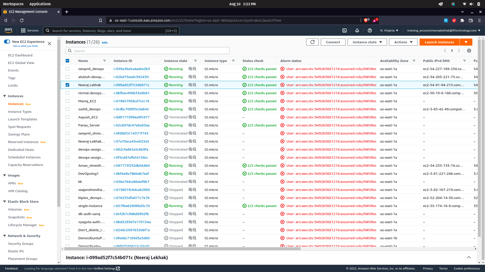
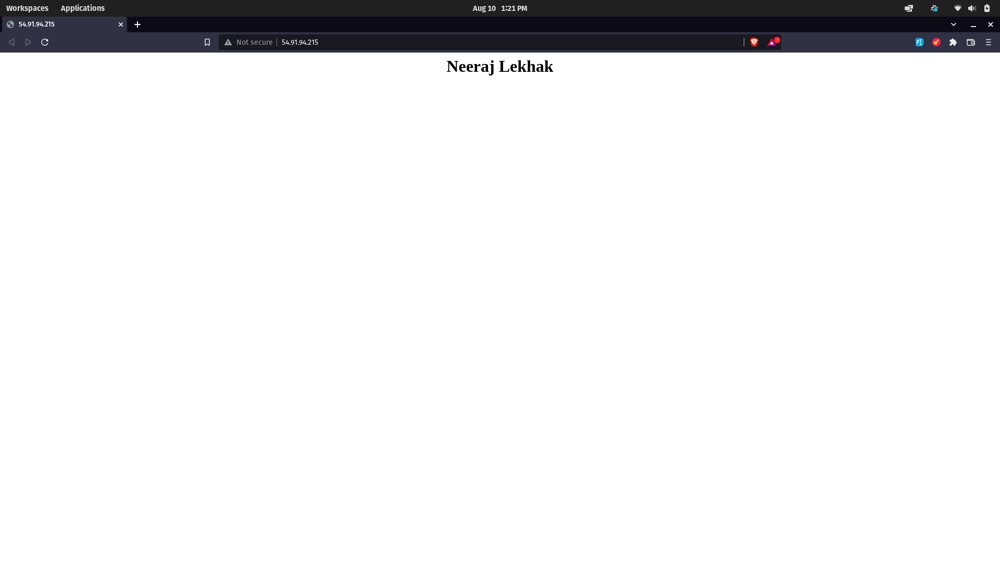

# 1. Launch an EC2 instance and login via ssh furthermore, install httpd(apache).

## EC2 instance with T2.micro configuration created in AWS:
 


## A web page served with apache2 running.  
 

### commands to install apache in ec2 instance

1. Update (optional)

``` sudo apt-get update ``` 

2. Install apache

``` sudo apt-get install apache2 ```


3. Configure Your Firewall

``` sudo ufw allow 'Apache'```


4. Restart Apache

``` sudo systemctl restart apache2 ```