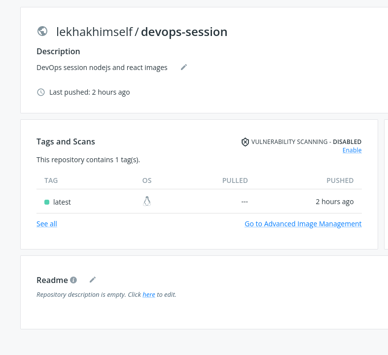
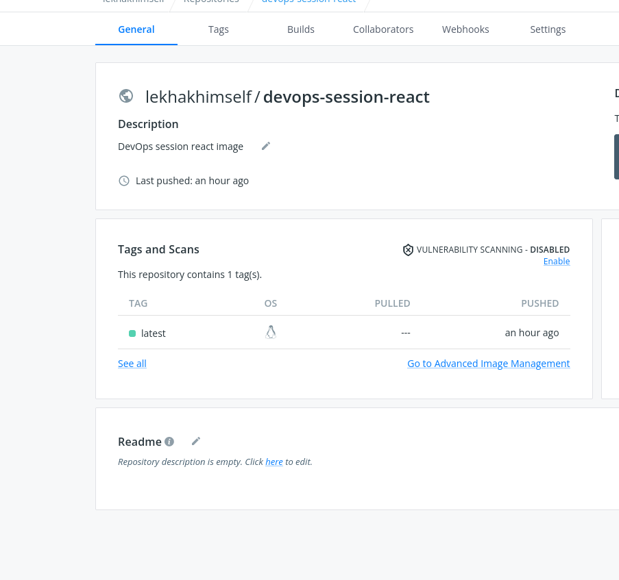

# 2.Create a Dockerfile for node js and react and push the created docker images to the docker hub repository.

# Docker Images for Nodejs and React

## Nodejs image in Docker Hub
   [nodejs image link](https://hub.docker.com/repository/docker/lekhakhimself/devops-session)

## React image in Docker Hub
   [react image link](https://hub.docker.com/repository/docker/lekhakhimself/devops-session-react)
